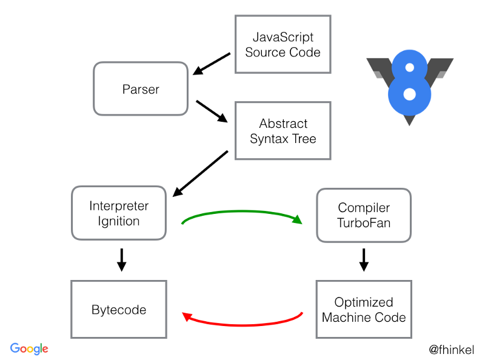

## Cómo funciona el intérprete Javascript V8

V8 compila el código Javascript a código de máquina nativo antes de ejecutarlo, en lugar de usar técnicas más tradicionales de compilado como interpretar el bytecode o compilar el programa completo a código de máquina y ejecutarlo desde archivos del sistema.

Está construido para ejecutar un hilo por contexto de ejecución Javascript. Esto no significa que V8 se ejecute en un sólo hilo, si no que provee un flujo de ejecución Javascript de un sólo hilo.

### ¿Qué hace V8?
1. Compila y ejecuta el código Javascript.
2. Maneja la pila de llamadas.
3. Maneja la asignación de memoria para los objetos.
4. Recolecta la basura de objetos que no vuelven a ser usados en la aplicación.
5. Provee los tipos de datos, operadores, objetos y funciones.

#### ¿Qué no hace V8?
Por supuesto, V8 no sabe nada acerca del árbol de objetos del documento (DOM), el cual es provisto por el navegador. En una aplicación NodeJS, por ejemplo, no tienes DOM.

### Compilación JIT
V8 obtiene su velocidad de una compilación en tiempo real (*just in time `==` **JIT***) a código de máquina nativo, justo antes de ejecutarlo:

1. El código es compilado por un compilador de base, que genera rápidamente código de máquina no optimizado. El intérprete [Ignition](https://v8.dev/docs/ignition) se encarga de esto.
2. En tiempo de ejecución, el código compilado es analizado y puede ser recompilado para un rendimiento óptimo. Los compiladores de optimización [TurboFan](https://v8.dev/docs/turbofan) y [CrankShaft](https://stackoverflow.com/questions/44764777/what-is-crankshaftscript-in-node-js) se encargan de esto.

> El proyecto [TurboFan](https://v8.dev/docs/turbofan) fue comenzado en 2013 para mejorar las debilidades de CrankShaft, el cual no estaba optimizado para una parte de las funcionalidades de Javascript, por ejemlo, el manejo de errores.

### Recolección de basura
La recolección de basura es realizada por el recolector [Orinocco](https://v8.dev/blog/orinoco-parallel-scavenger), el cual busca a través de la pila de memoria asignaciones de memoria desconectadas. Implementa un recolector de basura "generacional" que funciona moviendo objetos generados hace poco (objetos jóvenes) a la generación anterior, objetos generados hace más tiempo. Estos movimientos generan agujeros de memoria, por lo que este recolector también evacúa y compacta estos objetos para liberar espacio.

Otra optimización realizada por este recolector de basura es la forma en la que se mueve a través de la pila de memooria buscando todos los punteros que apuntan la antigua localización de objetos movidos, actualizándolos para que apunten a la nueva posición de memoria.

> Fuentes:
- [Javascript V8 engine explained - Yotam Kadishay for HackerNoon](https://hackernoon.com/javascript-v8-engine-explained-3f940148d4ef)
