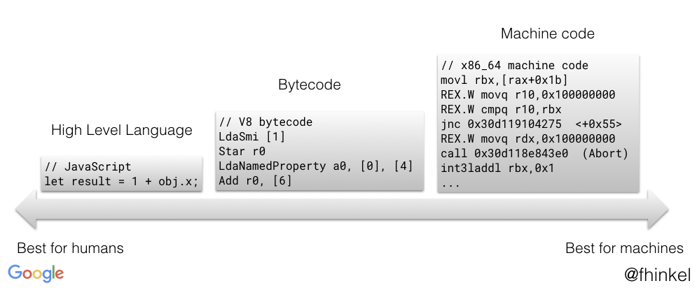

## Entendiendo el bytecode de V8
Cuando V8 compila el código Javascript, el parser genera un árbol sintáctico abstracto. Un árbol sintáctico es una representación de la estructura sintáctica del código. [Ignition](https://v8.dev/docs/ignition), el intérprete genera el bytecode utilizando este árbol sintáctico. [TurboFan](https://v8.dev/docs/turbofan), el compilador de optimización, toma el bytecode y genera el código de máquina optimizado.

El bytecode es una abstracciónd el código máquina. Compilar bytecode a código de máquina es más fácil si el bytecode fue diseñador con el mismo modelo computacional que la estructura computacional de la CPU. Esta es la razón por la cual los intérpretes son, a menudo, "registros" (*registers*) o "máquinas de apilado" (*stack machines*). Ignition es una máquina de registro con un acumulador de registros.



Puedes pensar en el bytecode como pequeños bloques de construcción que, juntos, componen cualquier funcionalidad Javascript. Hay bytecodes para operadores como `Add` o `TypeOf`, o para carga de propiedades como `LdaNamedProperty`. El archivo [`bytecodes.h`](https://github.com/v8/v8/blob/master/src/interpreter/bytecodes.h) define la lista completa de bytecodes incluidos en V8.

Cada bytecode especifica sus entradas y salidas como operandos de registro. Ignition usa los registros `r0, r1, r2, ...` y un acumulador de registro. Casi todos los bytecodes usan el acumulador de registro. Es como un registro regular, excepto que los bytecodes no lo especifican. Por ejemplo `Add r1` añade el valor `r1` en el registro `r1` al valor en el acumulador. Esto mantiene los bytecodes más cortos y ahorra memoria.

Muchos de los bytecodes comienzan con `Lda` o `Sda`. La `a` en `Lda` y `Sta` se refieren a **a**cumulador. Por ejemplo, `LdaSmi [42]` carga el entero pequeño `Smi` (abreviatura de *small integer*) `42` en el registro acumulador. `Star r0` almacena el valor que actualmente se encuentra en el acumulador en el registro `r0`. 

### Ejemplo práctico
Si vienes de un lenguaje en el cual el tipado de objetos provee optimización a tu código podrías pensar que, escribiendo `var a = new String("...");` obtendrás un código más óptimo que `var a = "...";`. Esto me pasó a mi, pero estaba muy equivocado, como puedes observar en [esta pregunta en StackOverflow](https://stackoverflow.com/questions/56686437/why-var-a-is-faster-than-var-a-new-string).

#### ¿Cómo puedo saber que implementación es más óptima?
Ejecuta el archivo `simple-return.js` mediante el comando `node --print-bytecode simple-return.js` (debes tener NodeJS instalado). Te saldrán muchísimas líneas de letras y números rarísimos en la consola. Quiero que busques algo parecido al siguiente trozo:

```
[generated bytecode for function: ]
Parameter count 6
Frame size 0
    0 E> 0x8073a6d377a @    0 : a0                StackCheck 
    0 S> 0x8073a6d377b @    1 : 12 00             LdaConstant [0]
   13 S> 0x8073a6d377d @    3 : a4                Return 
Constant pool (size = 1)
Handler Table (size = 0)
```

Ese cacho es el bytecode generado para la sentencia `return "...";` que contiene el script `simple-return.js` ubicado en esa carpeta. La sentencia `LdaConstant` significa carga una constante en el acumulador. La sentencia `Return` significa devuelve el valor situado en el acumulador.

Ahora ejecuta el archivo `oo-return.js` mediante el comando ``node --print-bytecode simple-return.js``. La salida correspondiente a la sentencia `return new String("...");` será:

```
[generated bytecode for function: ]
Parameter count 6
Frame size 16
    0 E> 0x1ef0f5053772 @    0 : a0                StackCheck 
    0 S> 0x1ef0f5053773 @    1 : 13 00 00          LdaGlobal [0], [0]
         0x1ef0f5053776 @    4 : 26 fb             Star r0
         0x1ef0f5053778 @    6 : 12 01             LdaConstant [1]
         0x1ef0f505377a @    8 : 26 fa             Star r1
         0x1ef0f505377c @   10 : 25 fb             Ldar r0
    7 E> 0x1ef0f505377e @   12 : 62 fb fa 01 02    Construct r0, r1-r1, [2]
   25 S> 0x1ef0f5053783 @   17 : a4                Return 
Constant pool (size = 2)
Handler Table (size = 0)
```

No voy a explicar todo lo que estaría ocurriendo aquí (porque no lo sé con certeza), pero puedes intuirlo: estamos construyendo un objeto a partir de la constante que hemos generado, lo cual envuelve muchos más pasos a nivel de bytecode en V8. Y es por esto que, aunque esta implementación pudiera parecer más explícita porque tu pudieras pensar "bueno, ya le estoy indicando al compilador el tipo de la variable, va a tener que ahorrarse el paso de inferirla", esto no es para nada cierto.

> Fuentes:
- [Understanding V8's bytecode - Francisca Hinkelmann](https://medium.com/dailyjs/understanding-v8s-bytecode-317d46c94775)