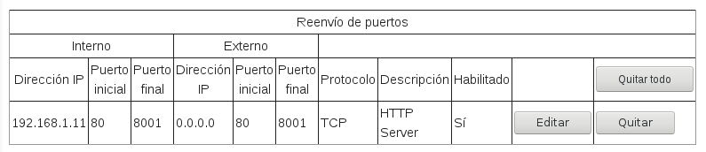
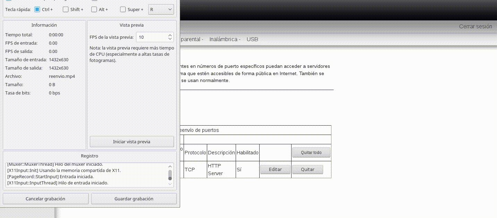

## Redirección de puertos
Imagina que quieres levantar un servidor web en un ordenador local, por ejemplo una Raspberry. También queremos poder acceder al ordenador directamente a través de una IP o un host, pero gratuito.

Para acceder desde el exterior no podemos tener una IP pública dinámica ya que si cambia deberemos estar consultando constantemente la nueva IP. Para solucionar este problema existen servicios como [NoIP](https://www.noip.com/) que por un periodo de tiempo (30 días en este caso) te permiten redirigir un nombre de host a una IP cambiante ya que corremos un demonio con el cliente de NoIP en el servidor, el cual actualiza automáticamente la IP.

### Paso a paso
En este tutorial vamos a implementar un servidor en Python que correrá en una Raspberry al cual vamos acceder desde la red global a través de un hostname de NoIP.

1. Regístrate en [NoIP](https://www.noip.com/) si aún no lo has hecho.
2. Descárgate el cliente NoIP2 en el ordenador donde correrá el servidor y [sigue los pasos de instalación](http://www.noip.com/support/knowledgebase/installing-the-linux-dynamic-update-client/). Tienes los comandos para controlar el programa en el archivo `LEEME.PRIMERO`.
3. Configuramos la IP de la máquina donde correremos el servidor para que sea estática. Puedes seguir [este pequeño tutorial](https://github.com/mondeja/fullstack/tree/master/backend/src/012-protocolos_red/IP/static).
4. Registra un dominio en NoIP a través de la interfaz gráfica de la página.
5. Creamos un pequeño servidor. Yo he decidido hacerlo con Tornado (Python), pero puedes hacerlo como te apetezca. Lo mostramos a través de algún puerto (en mi caso 8001) y la dirección 0.0.0.0 para poder acceder a él desde la red externa.
6. Corremos el cliente NoIP2 con el comando `sudo /usr/local/bin/noip2` y  observamos si está corriendo con `sudo noip2 -S`. Deberá aparecer que NoIP está corriendo para una IP concreta. Esa es nuestra IP pública, por lo que vamos a apuntarla en un papel.
7. Ahora llega el paso más importante y que más dolores de cabeza trae. Debemos reenviar las peticiones entrantes en el puerto 80 de nuestra IP pública hacia el puerto donde está corriendo nuestro servidor. Esto es así porque el router no viene configurado para abrir un puerto que no sea el 80 por motivos de seguridad. Por lo tanto vamos al router, a la parte de reenvío de puertos (depende de cada router) y redireccionamos. Puedes ver mi configuración en la siguiente imagen:  Como puedes ver internamente redireccionamos a través de la IP estática (que sólo funciona para la red local) y externamente a través de 0.0.0.0 (para entrar desde la red externa).
8. Lo siguiente es hacer la primera prueba. Para ello es útil la página [canyouseeme.org](http://www.canyouseeme.org/), la cual nos permite comprobar si un puerto concreto de una IP pública está abierto al exterior. Por lo tanto arrancamos el servidor, vamos a la página y comprobamos si el puerto al cual hemos redireccionado está abierto para la IP pública que apuntamos en el paso 6. Si recibes el mensaje de `Success`, enhorabuena, pero si no es así revisa de nuevo todo paso por paso. El la siguiente animación puedes ver como el puerto queda cerrado cuando desactivamos el reenvío de puertos. 
9. El último paso es acceder a través del dominio que generamos en el paso 4. Para ello simplemente accedemos a través del dominio en lugar de la IP. Tu dominio expira cada 30 días por lo que debes renovarlo desde la interfaz web de NoIP. Si no renovaste tu dominio y has creado otro nuevo debes reinicializar la configuración del cliente ejecutando `/usr/local/bin/noip2 -C` y respondiendo a las preguntas que te marca el programa.

### Comandos principales de NoIP
- Arrancar el demonio de NoIP: `sudo /usr/local/bin/noip2`
- Comprobar que está activo: `sudo noip2 -S`
- Crear un archivo de configuración: `/usr/local/bin/noip2 -C`
