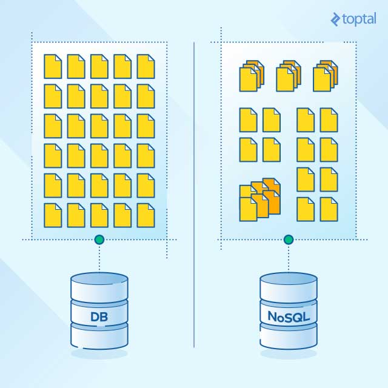

## Bases de datos
Una diferencia clave entre las bases de datos de NoSQL y las bases de datos relacionales tradicionales, es el hecho de que NoSQL es una forma de almacenamiento no estructurado:

Esta tabla ofrece una breve comparación entre las funcionalidades de NoSQL y las bases de datos relacionales:

### SQL
- [MySQL](https://github.com/mondeja/fullstack/tree/master/backend/src/013-db/mysql) (py, js, rb, sql)
- [PostgreSQL](https://github.com/mondeja/fullstack/tree/master/backend/src/013-db/postgresql)

### NoSQL
- [Cassandra](https://github.com/mondeja/fullstack/tree/master/backend/src/013-db/cassandra) (cql, py)
- [MongoDB](https://github.com/mondeja/fullstack/tree/master/backend/src/013-db/mongodb) (py, js, rb)
- [Redis](https://github.com/mondeja/fullstack/tree/master/backend/src/013-db/redis) (py)

__________________________________-

> Ampliación:
  - https://blog.pandorafms.org/es/bases-de-datos-nosql/