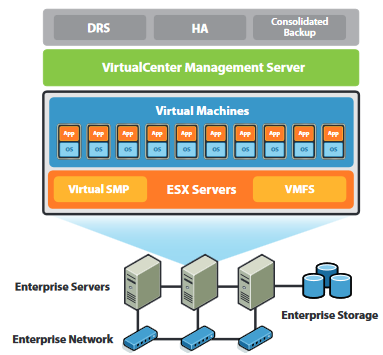

## Servicios de virtualización proporcionados por VMWare

La infraestructura VMware es la primera suite de virtualización de una infraestructura computacional completa de la industria. Ésta permite a las pequeñas y medianas empresas transformar, gestionar y optimizar su infraestructura de sistemas de IT mediante la virtualización por igual. VMware proporciona virtualización completa, gestión, optimización de recursos, disponibilidad de aplicaciones y automatización de operaciones en una oferta integrada.

- **Virtual Infraestructure Client (VI Client)**: interfaz que permite a los administradores y a los usuarios conectarse remotamente al VirtualCenter management Server o a instalaciones individuals de ESX Server desde cualquier PC Windows.
- **Virtual Infraestructure Web Access**: interfaz web para la gestión y acceso remotos a una máquina virtual.
- **VirtualCenter Management Server**: el punto central para configurar, aprovisionar y gestionar infraestructuras IT virtualizadas.
- **VMware Consolidated Backup**: provee una instalación centralizada y fácil de utilizar para el backup por parte de agentes libres de máquinas virtuales. Esto simplifica la administración del backup y reduce la carga en las instalaciones de servidores ESX.
- **VMware Distributed Resource Scheduler (DRS)**: Asigna de manera inteligente y balancea la capacidad computacional dinámicamente a lo largo de una colección de recursos hardware para máquinas virtuales.
- **VMware ESX Server**: capa de virtualización de ejecución probada en servidores físicos que abstrae el procesador, la memoria, el almacenamiento y los recursos de red para poder aprovisionar a múltiples máquinas virtuales.
- **VMware High Availability (HA)**: provee con facilidad de uso, alta disponibilidad y rentabilidad para aplicaciones que se ejecutan sobre máquinas virtuales. En caso de fallo del servidor, las máquinas virtuales afectadas se reinician automáticamente en otros servidores de producción que tienen capacidad reservada.
- **VMware Infraestructure SDK**: provee una interfaz estándar para VMware y soluciones de terceros para acceder a la infraestructura VMware.
- **VMware Virtual Machine File System (VMFS)**: un sistema de ficheros en cluster de alto rendimiento para máquinas virtuales.
- **VMware Virtual Symmetric Multi-Processing (SMP)**: permite a una máquina virtual individual usar múltiples procesadores físicos simultáneamente.
- **VMware VMotion**: permite la migración en caliente de máquinas virtuales ejecutándose desde un servidor físico a otro con ningún downtime, con disponibilidad del servicio contínua e integridad completa de la transacción.
