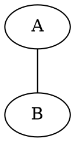
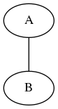
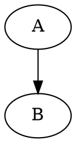
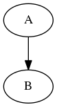

## Introducción a los diagramas de flujo con Graphviz y DOT

Un diagrama con DOT se crea mediante un archivo con formato `.dot`, del cual podemos obtener una representación en forma de imagen.

### Línea de comandos

Para obtener un archivo de imagen a partir de un archivo `.dot` usamos la utilidad de línea de comandos `dot`, la cual se instala en el sistema al instalar Graphviz. Si queremos obtener el resultado en `.png`, ejecutaremos el siguiente comando:

```
dot -Tpng -o nombre_de_archivo_resultante.png nombre_de_archivo_origen.dot
```

> [Referencia de invocación de línea de comandos de Graphviz](https://www.graphviz.org/doc/info/command.html)

### Diagramas dirigidos vs sin dirección

Hay dos estructuras básicas que podemos utilizar a la hora de crear gráficos con DOT y Graphviz, un diagrama (`graph`) y un diagrama dirigido (`digraph`). La diferencia entre ambos es que un diagrama normal, no tienes flechas, es decir, existen relaciones entre los nodos pero estas no se relacionan de forma direccional; mientras que los gráficos dirigidos si tienen una dirección.

> A la hora de crear diagramas de flujo para código, casi siempre usaremos diagramas dirigidos (`digraph`).

#### Ejemplo de diagrama sin dirección




#### Ejemplo de diagrama dirigido


