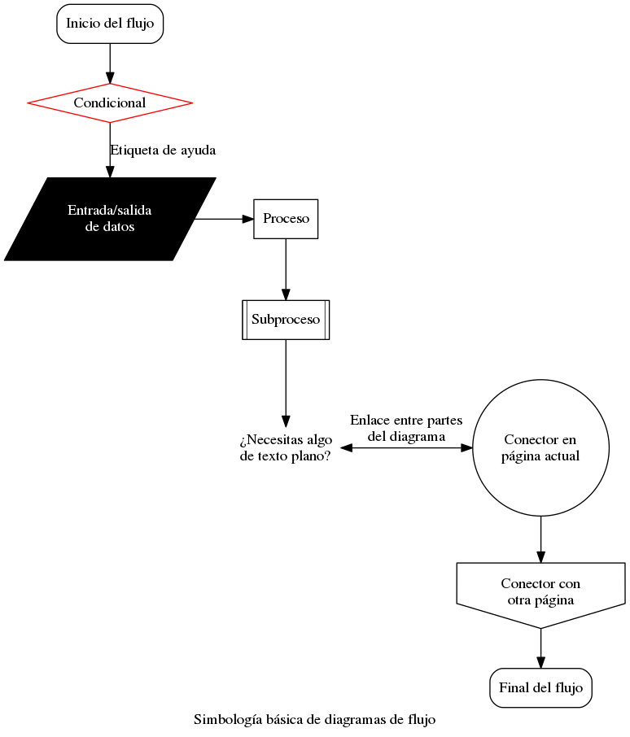
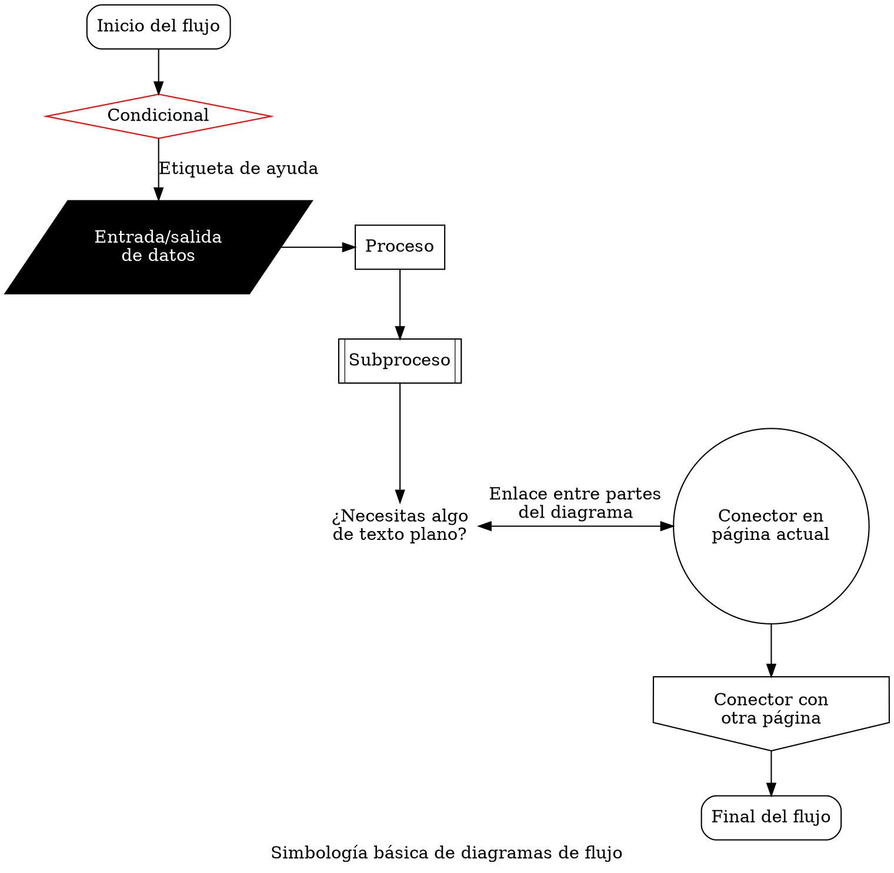

## Simbología básica de diagramas de flujo en DOT

```dot
digraph {
    label="Simbología básica de diagramas de flujo"

    /* ------------------------------------------------------ */

    /*                      Nodos                     */
    if_else[shape="diamond",
            style="",
            label="Condicional",
            color="red"];
    input_output[shape="parallelogram",
                 style="filled",
                 label="Entrada/salida\nde datos",
                 fillcolor="black",
                 fontcolor="white"];
    process[shape="box",
            label="Proceso",
            style=""];
    plain_text[shape="plaintext",
               label="¿Necesitas algo\nde texto plano?"];
    connector_same_page[shape="circle",
                        label="Conector en\npágina actual"];
    connector_other_page[shape="invhouse",
                        label="Conector con\notra página"];
    subprocess[shape="rect",
               style="striped",
               fillcolor="white;0.05:white;0.90:white",
               label="Subproceso"];

    /*  Podemos usar la palabra clave 'node' para declarar
          grupos de atributos y aplicarlos a diferentes nodos:
    */
    node[shape="box", style="rounded"] start; end;
    start[label="Inicio del flujo"];
    end[label="Final del flujo"];

    /* ------------------------------------------------------ */


    /* ------------------------------------------------------ */

    /*                     Flujo                */
    start -> if_else;
    if_else -> input_output[label="Etiqueta de ayuda"];
    input_output -> process;
    process -> subprocess;
    subprocess -> plain_text;
    plain_text -> connector_same_page[label="Enlace entre partes\ndel diagrama",
                                      dir="both"];
    connector_same_page -> connector_other_page;
    connector_other_page -> end;

    /* ------------------------------------------------------ */

    /*              Posicionado de nodos          */
    
    /**
     * Si no te convence el diseño del flujo, puedes hacer
     *      que varios nodos se encuentren en la misma línea:
     **/
    {rank=same; input_output process}
    {rank=same; plain_text connector_same_page}

    /* ------------------------------------------------------ */
}
```
