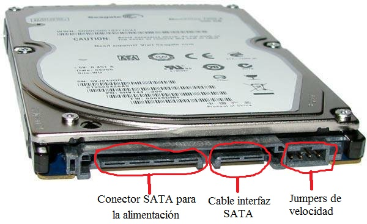

## Extraer datos de antiguos discos duros

Si tenemos un atiguo disco duro de un PC que ya no utilizamos, podemos conectarlo a nuestro ordenador y obtener todos los archivos aunque el disco duro no posea entradas USB.

Para ello hay que entender que los discos duros modernos suelen traer entradas SATA, tal como se muestra en la siguiente imagen:

Las conexiones de tipo SATA constan principalmente de un cable de alimentación y un cable por el que se transfieren los datos. 

Necesitamos extraer datos de un antiguo disco duro, por lo que si nuestro ordenador tiene 2 o más entradas SATA o USB, se pueden conectar otros discos donde almacenamos la información que extraemos. Dependiendo del número de conexiones de discos duros que soporte el ordenador, tendremos que seguir una estrategia u otra.

### Ordenador con dos conexiones SATA (datos y corriente cada una)
Tengo un ordenador que soporta conexiones SATA a dos discos duros externos. Tengo una partición raíz en `/` con un SSD para que arranque la máquina en poco tiempo, y luego una partición con un HHD en `/home` para almacenamiento. Mi propósito es extraer datos del disco duro de un antiguo PC.

El proceso a seguir es el siguiente:

1. Abrimos el ordenador.
2. Desconectamos las conexiones SATA para el disco de almacenamiento.
3. Conectamos esas conexiones en el disco duro antiguo.
4. Arrancamos el ordenador.

Debido a que el *boot* se realiza desde el disco duro SSD, el arranque se realizará normalmente en una distribución Linux, pero al comprobar que no se encuentra la partición `/home`, el sistema entrará en modo de reparación/emergencia y entraremos como superusuarios a la terminal.

### Comandos útiles
Lo primero será ver los discos duros conectados con `fdisk -l`. De la información que aparece nos interesa sobre todo la ruta de nuestro disco duro antiguo (aparece como `/dev/sdbx` donde `x` será un número).

Lo que debemos hacer es montar el disco duro para acceder a los archivos. Para ello ejecutamos `mount /dev/sdbx /media/temp` y luego accederiamos a `/media/temp` para acceder a los archivos. Esta ruta puede ser cualquiera en principio, aunque lo suyo es usar `media` debido a que es el directorio por defecto donde montar componentes extraíbles en Linux. El comando `mount` toma la ruta de un dispositivo como primer parámetro y la ruta donde queremos montar el sistema de archivos del dispositivo extraíble.

