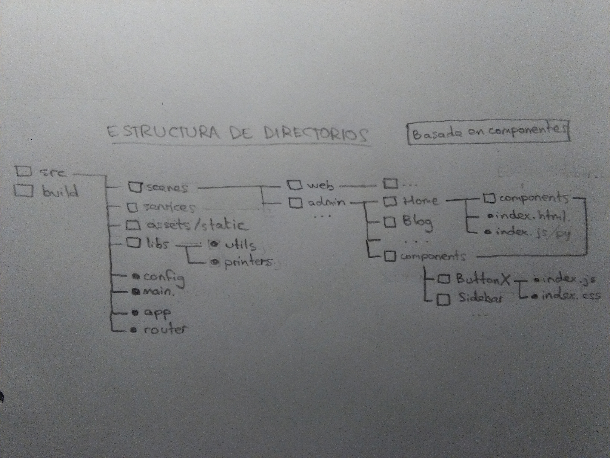

## Estructura basada en componentes

Cada componente, escena o servicio tiene todo lo que necesita para funcionar, tal como sus propios estilos, imágenes, traducciones, conjunto de acciones, tests de integración y unitarios...

> Fuente:
> https://medium.com/@alexmngn/how-to-better-organize-your-react-applications-2fd3ea1920f1