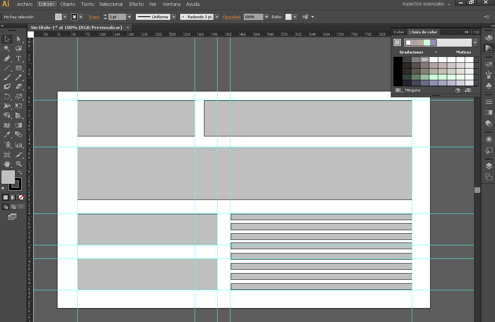

### Diseño de estructura web en Illustrator

El tamaño más recomendable es 960 px de ancho.

Conviene empezar diseñando la web añadiendo rectángulos donde irán las diferentes partes, para hacernos una idea general. Para ello simplemente utilizamos rectángulos y vamos definiendo por encima las diferentes partes.

Cuando las tengamos definidas, podemos pasar de los rectángulos a las guías. Para añadir guías en Illustrator vamos a `Ver -> Reglas -> Mostrar reglas` o pulsando `Ctrl + R`. Sólo queda arrastrar desde las reglas que nos aparecen a los extremos de la mesa de trabajo para establecer las guías celestes que vemos en la imagen de arriba.

- Para ver y ocultar las guías: `Ctrl + ;`

A partir de aquí puedes crear todos los elementos, utilizar sectores y maquetar en programas como Adobe Dreamweaver, pero yo personalmente prefiero utilizar Bootstrap o Foundation para un diseño responsive desde 0 y utilizar Illustrator sólo para la generación de imágenes.

> Fuentes:
> - https://design.tutsplus.com/es/tutorials/use-adobe-illustrator-to-create-a-clean-website-layout--vector-596
> - https://helpx.adobe.com/es/illustrator/using/rulers-grids-guides-crop-marks.html